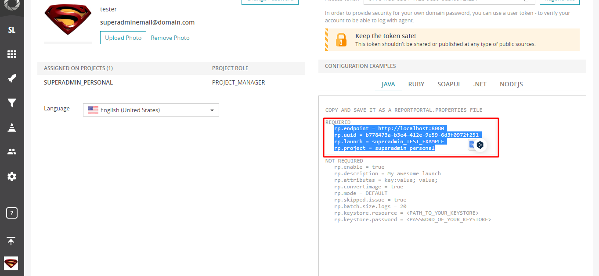

# Report Portal
### Инструкция для запуска учебного проекта
1. Запустить тестируемое приложение командой
```
-java jar artifacts/app-card-delivery.jar
```
2. Запустить контейнеры Report Portal командой
```
docker-compose -p reportportal up -d --force-recreate
```
3. Открыть страницу `http://localhost:8080/ui/` с логином: `superadmin`, и паролем: `erebus`
4. Открыть `http://localhost:8080/ui/#user-profile` и скопировать CONFIGURATION EXAMPLES в файл [reportportal.properties](../.src/test/resources/reportportal.properties)

5. запустить тесты командой
```
./gradlew clean test
```
7. Просмотреть отчёты на странице `http://localhost:8080/ui/#superadmin_personal/launches/all`


## [Репорты по обнаруженным дефектам](https://github.com/mzrivan/Patterns-task1/issues)
